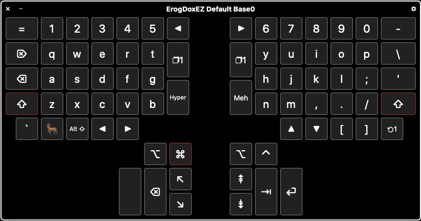

# ErgoDoxEZ Default Base 0 Layer

To install this Viewer in you macOS

0. Copy `ErgoDoxEZ-Default-Base0.ascconfig` folder from repo to any temp folder
0. Go to System Preferences -> Keyboard
0. In first tab "Keyboard" check "Show keyboard and emoji viewers in menu bar"
0. Select "Input Sources" tab
0. Check "Show Input menu in menu bar"
0. Go to System Preferences -> Accessibility
0. From left menu select "Keyboard"
0. Check "Enable Accessibility Keyboard"
0. Click "Panel Editor..."
0. In Panel Editor go to menu File -> Import Panels...
0. Select `ErgoDoxEZ-Default-Base0.ascconfig` from temp folder (where it copied to in step 1) click import
0. Save changes
